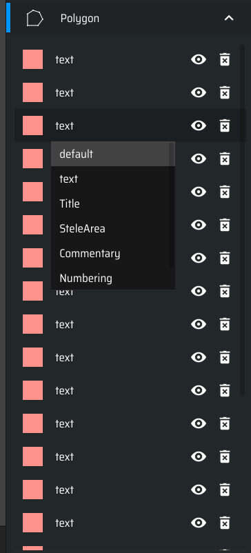
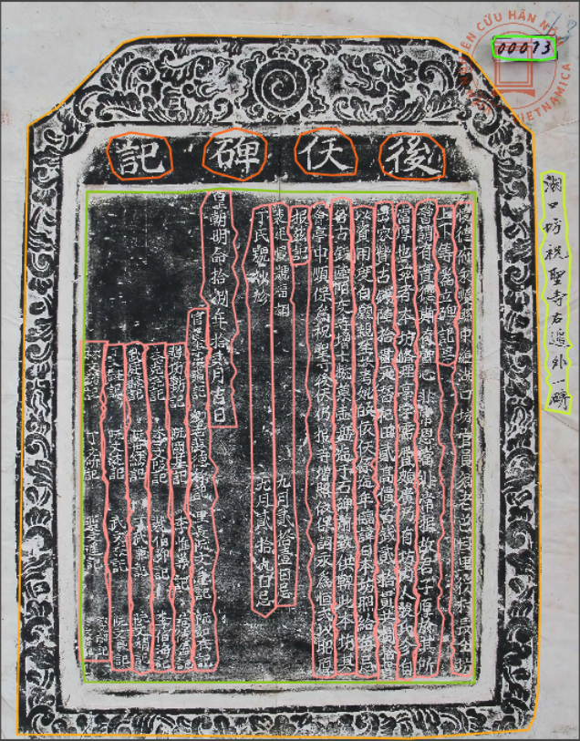

# Processus de la préparation de notre vérité de terrain. 

On a 32 images qu'il faut segmenter pour avoir une vérité de terrain afin d'entrainer notre modèle. 

Je vais illustrer le processus en prennant l'exemple de l'image 00073.jpg

Télécharger le code/scripts de ce tuto : `git clone https://github.com/AY2018/ground-truth.git`

## Étape 1 : Segmentation initiale 

On utilise kraken pour pour réaliser une segmentation initiale rapide 

```bash
kraken --alto -i 00073.jpg 00073.xml segment -bl -i modele_47.mlmodel 
```

On obtient un fichier XML ALTO avec une segmentation plus au moins bonne, mais qui nécessite quelques ajustements pour avoir une vérité de terrain optimale car = 

1. On a toujours la baseline que l'on ne veut pas = 
```xml
<TextLine ID="line_21" HPOS="3578" VPOS="1339" WIDTH="196" HEIGHT="1335" BASELINE="3676 1343 3721 1678 3709 2066 3729 2221 3725 2527 3750 2674" TAGREFS="TYPE_1">
```

2. La segmentation n'est pas parfaite. 

## Étape 2 : Convertir en JSON COCO 

Le scritp **alto_to_json.py** permet de récupérer seulement les coordonnées des polygonnes du fichier alto (ce que l'on cherche à conserver), ce qui nous permet en plus de nous débarasser de la baseline. 

**Il faut mettre le nom du fichier xml que l'on veut convertir en JSON**

```python 
# Ce script permet de passer d'un fichier ALTO crée par le modèle 47 à un fichier COCO JSON que l'on peut utiliser sur makesense.ai pour corriger les polygones.
# Il ne prend pas en compte les baselines, mais seulement les coordonées des polygones. 

import xml.etree.ElementTree as ET
import json
import os

# Load and parse the XML file
tree = ET.parse('00073.xml')
root = tree.getroot()


ns = {'alto': 'http://www.loc.gov/standards/alto/ns-v4#'}

# COCO JSON structure
coco_json = {
    "info": {"description": "my-project-name"},
    "images": [],
    "annotations": [],
    "categories": [
        {"id": 1, "name": "default"},
        {"id": 2, "name": "text"},
        {"id": 3, "name": "Title"},
        {"id": 4, "name": "SteleArea"},
        {"id": 5, "name": "Commentary"},
        {"id": 6, "name": "Numbering"},
        {"id": 7, "name": "Intext"}
    ]
}

# Function to extract coordinates from the polygon points
def extract_coordinates(polygon):
    return [float(coord) for point in polygon.split() for coord in point.split(',')]

# ID counters
image_id = 1
annotation_id = 1

# Add image info to COCO JSON
image_info = {
    "id": image_id,
    "width": 3840,
    "height": 4900,
    "file_name": "00073.jpg"
}
coco_json["images"].append(image_info)

# Extract polygons from the XML and add to annotations
for textline in root.findall('.//alto:TextLine', ns):
    for polygon in textline.findall('.//alto:Polygon', ns):
        points = polygon.get('POINTS')
        segmentation = extract_coordinates(points)
        bbox = [
            min(segmentation[::2]),  # min x
            min(segmentation[1::2]),  # min y
            max(segmentation[::2]) - min(segmentation[::2]),  # width
            max(segmentation[1::2]) - min(segmentation[1::2])  # height
        ]
        area = bbox[2] * bbox[3]

        annotation = {
            "id": annotation_id,
            "iscrowd": 0,
            "image_id": image_id,
            "category_id": 2,
            "segmentation": [segmentation],
            "bbox": bbox,
            "area": area
        }

        coco_json["annotations"].append(annotation)
        annotation_id += 1

# Increment the image ID for the next image
image_id += 1

# Save the COCO JSON to a file
with open('coco_format.json', 'w') as json_file:
    json.dump(coco_json, json_file, indent=4)

```

On veut maintenant visualiser ce que l'on a. 

Installation de makesense.ai 

```bash
git clone https://github.com/AY2018/make-sense2.git # Ce repo permet de supprimer les points d'un polygone contrairement à l'app officielle

cd make-sense

npm install

npm start # serveur est lancé sur localhost:3000
```

Get Started > Ajouter Image 00073.jpg > Object Detection > Start Project 

Importons nos annotations 

Menu en haut à gauche : Actions > Import annotatioons > Polygones > Choisir notre fichier COCO créé précédemment 


Et voila, on se retrouver avec des polygones de textes déjà crée. On remarque que tout les polygones on le même label, même l'annotation par exemple, c'est normal. Il suffit juste de modifier le label manuelement et de créer les annotations qui manquent. 



L'objectif principal, reste les polygonnes qui entourent le texte : 



Une fois notre travail finit, il suffit de les exporter : 

Menu en haut à gauche : Actions > Export Annotations > Polygones > Single file in COCO JSON format > Export. 

**On a maintenant un fichier COCO avec les bonnes annotations**

## Étape 3 (facultative/pour l'OCR) : de COCO vers ALTO 
Nom du script : **json_to_alto.py**

**Il faut mettre le nom du fichier json que l'on veut convertir en bas de script**
```python 

import json
import xml.etree.ElementTree as ET

def create_alto(coco_json, output_file):

    with open(coco_json) as f:
        data = json.load(f)
    
    # Root + Description
    root = ET.Element("alto")
    root.set("xmlns", "http://www.loc.gov/standards/alto/ns-v3#")
    root.set("xmlns:xlink", "http://www.w3.org/1999/xlink")
    root.set("xmlns:xsi", "http://www.w3.org/2001/XMLSchema-instance")
    root.set("xsi:schemaLocation", "http://www.loc.gov/standards/alto/ns-v3# http://www.loc.gov/standards/alto/v3/alto.xsd")
    
    
    description = ET.SubElement(root, "Description")
    ET.SubElement(description, "MeasurementUnit").text = "pixel"
    source_image_information = ET.SubElement(description, "sourceImageInformation")
    file_name = data['images'][0]['file_name']
    ET.SubElement(source_image_information, "fileName").text = file_name
    
    # Tags
    tags = ET.SubElement(root, "Tags")
    category_to_tagref = {category['name']: f"TYPE_{category['id']}" for category in data['categories']}
    for category_name, tag_id in category_to_tagref.items():
        other_tag = ET.SubElement(tags, "OtherTag")
        other_tag.set("ID", tag_id)
        other_tag.set("LABEL", category_name)
    
    # Layout
    layout = ET.SubElement(root, "Layout")
    page = ET.SubElement(layout, "Page")
    page.set("ID", "Page1")
    page.set("PHYSICAL_IMG_NR", "1")
    page.set("HEIGHT", str(data['images'][0]['height']))
    page.set("WIDTH", str(data['images'][0]['width']))
    
    print_space = ET.SubElement(page, "PrintSpace")
    print_space.set("HEIGHT", str(data['images'][0]['height']))
    print_space.set("WIDTH", str(data['images'][0]['width']))
    
    block_counter = 1

    # Helper functions
    def ensure_valid_bbox(bbox):
        return [int(round(x)) if x is not None else 0 for x in bbox]

    def convert_points(points):
        return " ".join([f"{int(round(x))} {int(round(y))}" for x, y in zip(points[::2], points[1::2])])

    def create_text_block(parent, bbox, points, tagref, block_counter):
        text_block = ET.SubElement(parent, "TextBlock")
        text_block.set("ID", f"block_{block_counter}")
        text_block.set("HPOS", str(bbox[0]))
        text_block.set("VPOS", str(bbox[1]))
        text_block.set("WIDTH", str(bbox[2]))
        text_block.set("HEIGHT", str(bbox[3]))
        if tagref:
            text_block.set("TAGREFS", tagref)
        
        shape = ET.SubElement(text_block, "Shape")
        polygon = ET.SubElement(shape, "Polygon")
        polygon.set("POINTS", points)

        return text_block, block_counter + 1

    def create_text_line(parent, bbox, points):
        text_line = ET.SubElement(parent, "TextLine")
        text_line.set("HPOS", str(bbox[0]))
        text_line.set("VPOS", str(bbox[1]))
        text_line.set("WIDTH", str(bbox[2]))
        text_line.set("HEIGHT", str(bbox[3]))

        shape = ET.SubElement(text_line, "Shape")
        polygon = ET.SubElement(shape, "Polygon")
        polygon.set("POINTS", points)

        string = ET.SubElement(text_line, "String")
        string.set("CONTENT", "")
    
    # Créer les éléments XML pour chaque annotation
    for ann in data['annotations']:
        category_name = next(cat['name'] for cat in data['categories'] if cat['id'] == ann['category_id'])
        points = convert_points(ann['segmentation'][0])
        bbox = ensure_valid_bbox(ann['bbox'])

        if category_name == "SteleArea":
            shape = ET.SubElement(print_space, "Shape")
            polygon = ET.SubElement(shape, "Polygon")
            polygon.set("POINTS", points)
            
            for sub_category in ["Numbering", "Commentary", "Title", "Intext"]:
                text_block, block_counter = create_text_block(print_space, bbox, points, category_to_tagref[sub_category], block_counter)
                if sub_category in ["Title", "Intext"]:
                    create_text_line(text_block, bbox, points)
        else:
            text_block, block_counter = create_text_block(print_space, bbox, points, category_to_tagref[category_name], block_counter)
            if category_name in ["Title", "Intext"]:
                create_text_line(text_block, bbox, points)
    
    # Write the XML to file
    tree = ET.ElementTree(root)
    tree.write(output_file, encoding="UTF-8", xml_declaration=True)


create_alto("00073new.json", "00073new.xml")
```

**ATTENTION !! Le fichier ALTO créé ne passe pas sur escriptorium, pour le visualiser: utiliser le script suivant**


Nom du script : **draw.py**

Installer : 
```bash
pip install pillow lxml
```
**Il faut mettre le nom du fichier image + alto**


```python 
# Ce script permet de dessiner des polygones sur une image à partir d'un fichier ALTO.
# L'output est une image avec les polygones dessinés avec une couleur différent pour chaque catégorie de polygonne : default, text, Title, Intext, Commentary, Numbering, SteleArea.
# Ce script a été créee sur mesure pour les fichiers ALTO créés à partir du fichier COCO JSON créé via makesense.ai. 

# Installer : pip install pillow lxml

# Ce script permet de dessiner des polygones sur une image à partir d'un fichier ALTO.
# L'output est une image avec les polygones dessinés avec une couleur différent pour chaque catégorie de polygonne : default, text, Title, Intext, Commentary, Numbering, SteleArea.
# Ce script a été créee sur mesure pour les fichiers ALTO créés à partir du fichier COCO JSON créé via makesense.ai. 

# Installer : pip install pillow lxml

import xml.etree.ElementTree as ET
from PIL import Image, ImageDraw
import random
from lxml import etree

def parse_alto_xml(alto_file):
    tree = etree.parse(alto_file)
    root = tree.getroot()
    
    namespaces = {
        'alto': 'http://www.loc.gov/standards/alto/ns-v3#'
    }
    
    # Parse categories 
    category_colors = {}
    tags = root.find('alto:Tags', namespaces)
    for tag in tags.findall('alto:OtherTag', namespaces):
        category_id = tag.get('ID')
        category_label = tag.get('LABEL')
        # Donner une couleur différente à chaque catégorie
        category_colors[category_id] = (random.randint(0, 255), random.randint(0, 255), random.randint(0, 255))

    # Parse polygons
    polygons = []
    for shape in root.findall('.//alto:Shape', namespaces):
        polygon = shape.find('alto:Polygon', namespaces)
        points = polygon.get('POINTS').split()
        points = [(int(points[i]), int(points[i + 1])) for i in range(0, len(points), 2)]
        parent = shape.getparent()
        while parent is not None and parent.tag != '{http://www.loc.gov/standards/alto/ns-v3#}TextBlock':
            parent = parent.getparent()
        if parent is None:
            continue  
        tagrefs = parent.get('TAGREFS')
        polygons.append((points, category_colors.get(tagrefs, (255, 255, 255))))
    
    return polygons

def draw_polygons(image_file, polygons, output_file, thickness=3):
    # Open an image file
    with Image.open(image_file) as im:
        draw = ImageDraw.Draw(im)
        # Draw each polygon with increased thickness
        for points, color in polygons:
            for i in range(len(points)):
                start_point = points[i]
                end_point = points[(i + 1) % len(points)]
                draw.line([start_point, end_point], fill=color, width=thickness)
        # Save the image with polygons
        im.save(output_file)


alto_file = '00073new.xml'
image_file = '00073.jpg'


output_file = 'output_avec_Polygones.jpg'


polygons = parse_alto_xml(alto_file)

# Call la fonction 
draw_polygons(image_file, polygons, output_file, thickness=5)

```